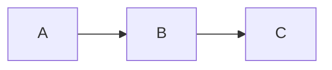
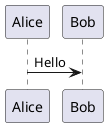

# Slidev Markdown 语法

Slidev 演示文稿的核心 Markdown 语法。

## 幻灯片分隔符

使用 `---`，前后留空行：

```md
# 幻灯片 1

内容

---

# 幻灯片 2

更多内容
```

## Headmatter（幻灯片组配置）

第一个 frontmatter 块配置整个幻灯片组：

```md
---
theme: default
title: 我的演示
lineNumbers: true
---

# 第一张幻灯片
```

## 单张幻灯片的 Frontmatter

每张幻灯片可以有自己的 frontmatter：

```md
---
layout: center
background: /image.jpg
class: text-white
---

# 居中幻灯片
```

## 演讲者备注

幻灯片末尾的 HTML 注释会成为演讲者备注：

```md
# 我的幻灯片

内容在这里

<!--
这些是演讲者备注。
- 记得提到 X
- 演示该功能
-->
```

## 代码块

使用 Shiki 高亮的标准 Markdown：

````md
```ts
const hello = 'world'
```
````

带功能：
````md
```ts {2,3}              // 行高亮
```ts {1|2-3|all}        // 基于点击的高亮
```ts {monaco}           // Monaco 编辑器
```ts {monaco-run}       // 可运行代码
```ts twoslash           // TypeScript 类型
```
````

## LaTeX 数学公式

行内：`$E = mc^2$`

块级：
```md
$$
\frac{-b \pm \sqrt{b^2 - 4ac}}{2a}
$$
```

## 图表

Mermaid：
````md

````

PlantUML：
````md

````

## Comark 语法

使用 `comark: true` 启用：

```md
[styled text]{style="color:red"}
{width=500px}
::component{prop="value"}
```

## 作用域 CSS

样式仅应用于当前幻灯片：

```md
# 红色标题

<style>
h1 { color: red; }
</style>
```

## 导入幻灯片

```md
---
src: ./pages/intro.md
---
```

导入特定幻灯片：
```md
---
src: ./other.md#2,5-7
---
```
