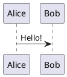

# PlantUML 图表

从文本描述创建 UML 图表。

## 基本用法

````md

````

## 服务器配置

默认：使用 https://www.plantuml.com/plantuml

在 headmatter 中自定义服务器：

```md
---
plantUmlServer: https://your-server.com/plantuml
---
```

## 图表类型

- 序列图
- 类图
- 活动图
- 组件图
- 状态图
- 对象图
- 用例图

## 资源

- PlantUML 文档：https://plantuml.com/
- 实时编辑器：https://plantuml.com/plantuml
